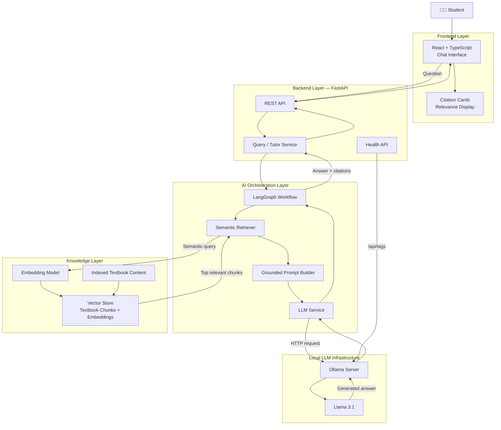
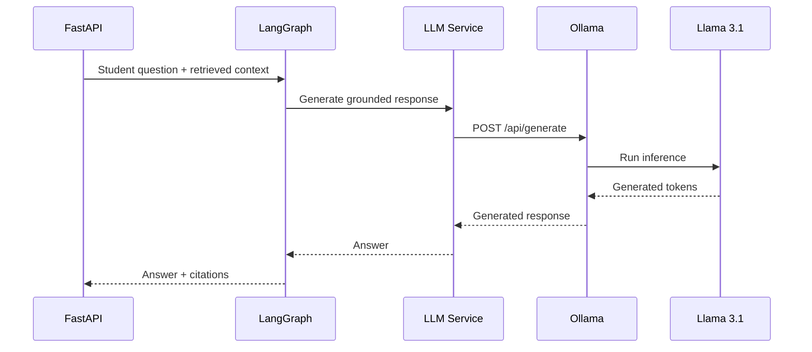
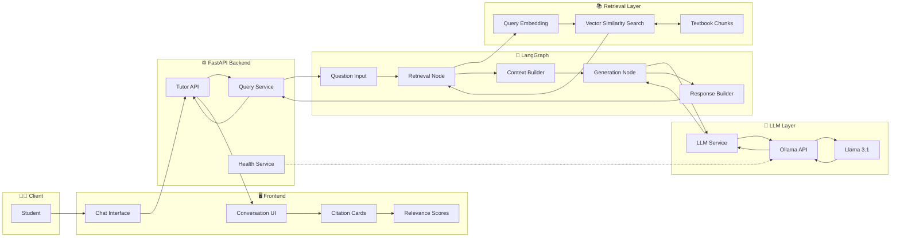
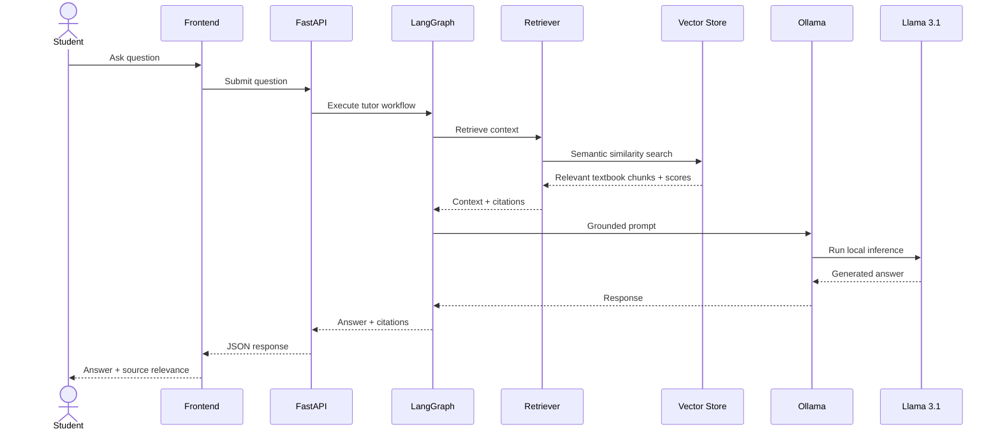

# 🎓 LearnMateAI

> **An AI-powered textbook tutor that answers student questions using course material, semantic retrieval, grounded generation, and source citations.**

LearnMateAI is an intelligent learning assistant designed to help students understand academic concepts using their own textbooks and learning material.

Instead of relying only on the general knowledge of a Large Language Model, LearnMateAI retrieves relevant passages from indexed educational content and uses those passages as context for generating answers.

Every grounded response can include citations pointing back to the relevant textbook passages, together with a semantic relevance score.

---

## 📌 Table of Contents

- [Overview](#-overview)
- [Problem Statement](#-problem-statement)
- [Key Features](#-key-features)
- [System Architecture](#-system-architecture)
- [How LearnMateAI Works](#-how-learnmateai-works)
- [RAG Pipeline](#-rag-pipeline)
- [Technology Stack](#-technology-stack)
- [Project Structure](#-project-structure)
- [Citation System](#-citation-system)
- [Ollama Integration](#-ollama-integration)
- [Health Monitoring](#-health-monitoring)
- [Getting Started](#-getting-started)
- [Environment Configuration](#-environment-configuration)
- [Running with Docker](#-running-with-docker)
- [Development Setup](#-development-setup)
- [Testing](#-testing)
- [API Flow](#-api-flow)
- [Example Query Flow](#-example-query-flow)
- [Error Handling](#-error-handling)
- [Performance Considerations](#-performance-considerations)
- [Troubleshooting](#-troubleshooting)
- [Future Improvements](#-future-improvements)
- [Security Considerations](#-security-considerations)
- [Contributing](#-contributing)
- [Author](#-author)
- [License](#-license)

---

# 🌟 Overview

LearnMateAI is a **Retrieval-Augmented Generation (RAG) based educational assistant**.

A student can ask a question such as:

> **What is a balanced chemical equation?**

Instead of directly forwarding the question to an LLM, LearnMateAI:

1. Receives the student's question.
2. Generates/searches its semantic representation.
3. Searches indexed textbook passages.
4. Retrieves the most relevant content.
5. Passes the retrieved context into a LangGraph workflow.
6. Sends the grounded prompt to a locally hosted Llama model through Ollama.
7. Generates a student-friendly explanation.
8. Returns the answer with textbook citations.
9. Displays semantic relevance scores for individual citations.

The result is an AI tutor that is significantly more useful for curriculum-specific learning than a generic chatbot.

---

# 🎯 Problem Statement

General-purpose AI assistants can provide useful explanations, but their answers are not always aligned with:

- a student's prescribed textbook,
- a specific syllabus,
- classroom terminology,
- uploaded learning material,
- or the exact source from which the answer originated.

They may also provide answers without indicating where the information came from.

LearnMateAI addresses this by combining:

- **semantic search**
- **vector retrieval**
- **textbook grounding**
- **LangGraph orchestration**
- **local LLM inference**
- **source citations**

to create a more transparent and curriculum-focused learning experience.

---

# ✨ Key Features

### 📚 Textbook-Grounded Answers

Responses are generated using relevant passages retrieved from indexed educational content.

### 🔍 Semantic Search

Questions are matched with textbook content based on semantic similarity rather than simple keyword matching.

### 🧠 Retrieval-Augmented Generation

Relevant textbook passages are supplied to the LLM before generation.

### 🔗 Source Citations

Generated answers include references to the textbook passages used to construct the response.

### 📊 Citation Relevance Scores

Each citation can display its own semantic relevance percentage.

Example:

```text
Relevance: 65.5%
```

### 🧩 LangGraph Orchestration

The question-answering workflow is managed using LangGraph, allowing the RAG pipeline to remain modular and extensible.

### 🦙 Local LLM with Ollama

LearnMateAI uses Ollama to run Llama locally rather than depending entirely on an external LLM provider.

Current model:

```text
llama3.1
```

Ollama resolves the installed model to:

```text
llama3.1:latest
```

### 🐳 Dockerized Architecture

The application is designed to run as multiple services using Docker Compose.

### ❤️ Health Monitoring

The backend verifies:

- Ollama availability
- configured model availability
- service health

without exposing unnecessary infrastructure details to users.

### 🛡️ Safe Error Handling

Detailed technical failures are logged server-side while the frontend receives a safe error message.

### 📱 Responsive Interface

Citation cards and chat elements adapt to smaller screens without overlapping metadata or relevance information.

---

# 🏗 System Architecture

## High-Level Architecture



---

# 🔄 How LearnMateAI Works

The complete runtime pipeline is:

```text
Student Question
      ↓
Frontend
      ↓
FastAPI
      ↓
LangGraph
      ↓
Semantic Retrieval
      ↓
Relevant Textbook Chunks
      ↓
Grounded Prompt Construction
      ↓
Ollama
      ↓
Llama 3.1
      ↓
Generated Answer
      ↓
Citation Mapping
      ↓
Similarity Scores
      ↓
Frontend Response
```

---

# 🧠 RAG Pipeline

LearnMateAI uses **Retrieval-Augmented Generation** to ensure answers remain grounded in educational content.

## 1. Student Question

Example:

```text
What is a balanced chemical equation?
```

---

## 2. Semantic Retrieval

The question is compared against the embeddings of indexed textbook passages.

Instead of searching only for exact words, semantic retrieval attempts to understand the meaning of the question.

For example:

```text
Student Question
       ↓
Question Embedding
       ↓
Vector Similarity Search
       ↓
Top Relevant Textbook Chunks
```

---

## 3. Context Selection

The most relevant textbook passages are selected.

Each retrieved passage contains information such as:

```text
document
chapter
page
text
similarity_score
```

---

## 4. Grounded Prompt Construction

Relevant textbook passages are inserted into the prompt supplied to the LLM.

Conceptually:

```text
SYSTEM:
You are a textbook tutor.

CONTEXT:
[Retrieved textbook passages]

QUESTION:
What is a balanced chemical equation?

INSTRUCTION:
Answer using the provided educational context.
```

---

## 5. LangGraph Execution

LangGraph manages the sequence between retrieval, prompt construction and response generation.

This makes it possible to extend LearnMateAI later with additional nodes such as:

```text
Question Classification
        ↓
Retrieval
        ↓
Context Validation
        ↓
Generation
        ↓
Citation Verification
        ↓
Answer Evaluation
```

---

## 6. LLM Generation

The completed grounded prompt is sent to the local Ollama server.

Current configuration:

```text
Model: llama3.1
Ollama service: http://ollama:11434
```

The LLM generates an explanation using the retrieved context.

---

## 7. Citation Mapping

Retrieved passages are returned together with the answer.

The frontend displays citation information so students can identify the educational source behind the explanation.

---

# 🧱 Technology Stack

| Layer | Technology |
|---|---|
| Frontend | React |
| Language | TypeScript |
| Styling | CSS |
| Backend | FastAPI |
| Backend Language | Python |
| AI Orchestration | LangGraph |
| LLM Runtime | Ollama |
| LLM | Llama 3.1 |
| Retrieval | Semantic / Vector Search |
| Architecture | Retrieval-Augmented Generation |
| API Communication | REST / HTTP |
| Containerization | Docker |
| Orchestration | Docker Compose |
| Backend Testing | Python `unittest` |
| Health Monitoring | FastAPI Health Endpoints |

---

# 📁 Project Structure

A simplified representation of the repository:

```text
LearnMateAI/
│
├── frontend/
│   ├── src/
│   │   ├── components/
│   │   │   └── CitationBadge.tsx
│   │   │
│   │   ├── index.css
│   │   └── ...
│   │
│   ├── package.json
│   └── ...
│
├── backend/
│   ├── app/
│   │   ├── api/
│   │   │   └── routes/
│   │   │       ├── health.py
│   │   │       └── ...
│   │   │
│   │   ├── core/
│   │   │   └── config.py
│   │   │
│   │   ├── services/
│   │   │   ├── llm_service.py
│   │   │   └── ...
│   │   │
│   │   └── ...
│   │
│   ├── tests/
│   │   ├── test_llm_service.py
│   │   └── ...
│   │
│   └── ...
│
├── docker-compose.yml
├── .env
├── .env.example
├── .gitignore
└── README.md
```

The exact internal layout may evolve as LearnMateAI develops.

---

# 🔗 Citation System

Citations are an important component of LearnMateAI's transparency.

Instead of returning only:

```text
A balanced chemical equation has an equal number of atoms of each
element on both sides of the equation.
```

LearnMateAI can also provide the textbook passages used for the answer.

Each citation can contain:

```json
{
  "document": "Chemistry Textbook",
  "chapter": "Chemical Reactions",
  "text": "...",
  "similarity_score": 0.655
}
```

---

## Citation Relevance

The frontend uses:

```text
similarity_score
```

to show the semantic similarity between the student's question and the retrieved textbook passage.

The calculation is:

```text
similarity_score × 100
```

For:

```json
{
  "similarity_score": 0.655
}
```

the interface displays:

```text
Relevance: 65.5%
```

### Formatting Rules

- Percentage uses **1 decimal place**
- Different citations retain their individual scores
- Citation ordering is preserved
- Citation count is preserved
- Missing values are not displayed
- A valid zero remains visible

Example:

```text
similarity_score = 0
```

displays:

```text
Relevance: 0.0%
```

Missing similarity score:

```text
similarity_score = null
```

results in no relevance text being rendered.

---

## Relevance Tooltip

The citation relevance indicator explains:

> **Semantic similarity between your question and this textbook passage.**

This is intentionally described as **semantic similarity**, not as answer correctness or confidence.

---

# 🦙 Ollama Integration

LearnMateAI runs its LLM using Ollama.

The backend communicates with the Ollama HTTP API.

Docker service URL:

```text
http://ollama:11434
```

Current model:

```text
llama3.1
```

Installed model:

```text
llama3.1:latest
```

---

## Ollama Generation Flow



---

# ❤️ Health Monitoring

LearnMateAI performs Ollama availability validation.

The backend can check:

1. Whether the Ollama server is reachable.
2. Whether `/api/tags` responds successfully.
3. Whether the configured model exists.

Conceptually:

```text
FastAPI Health Check
        ↓
GET /api/tags
        ↓
Ollama
        ↓
Available Models
        ↓
Verify llama3.1
```

Infrastructure details are logged internally but should not be unnecessarily exposed to end users.

---

# 🚀 Getting Started

## Prerequisites

Install:

- Git
- Docker Desktop
- Docker Compose
- Node.js
- Python
- Ollama, if running Ollama outside Docker

For the recommended setup, Docker Desktop should be running before starting the application.

---

## 1. Clone the Repository

```bash
git clone <your-repository-url>
cd LearnMateAI
```

---

## 2. Configure Environment Variables

Create the environment file from the provided template:

```bash
cp .env.example .env
```

On Windows PowerShell:

```powershell
Copy-Item .env.example .env
```

---

# ⚙️ Environment Configuration

Example configuration:

```env
OLLAMA_BASE_URL=http://ollama:11434

OLLAMA_MODEL=llama3.1

OLLAMA_GENERATION_TIMEOUT_SECONDS=300
```

Additional environment variables may exist depending on the project's storage, database, embedding and frontend configuration.

---

## Ollama Base URL

Because the backend and Ollama run as Docker Compose services, the backend uses the Compose service hostname:

```env
OLLAMA_BASE_URL=http://ollama:11434
```

Do **not** replace this with:

```text
http://localhost:11434
```

from inside the backend container.

Inside Docker, `localhost` refers to the container itself.

---

## Generation Timeout

LLM generation can take longer than normal HTTP requests.

LearnMateAI therefore supports a configurable timeout:

```env
OLLAMA_GENERATION_TIMEOUT_SECONDS=300
```

The timeout is intentionally finite.

---

# 🐳 Running with Docker

Build and start the project:

```bash
docker compose up --build
```

Or run in detached mode:

```bash
docker compose up --build -d
```

---

## View Running Containers

```bash
docker compose ps
```

---

## Backend Logs

```bash
docker compose logs -f
```

Or, for the API container:

```bash
docker logs tutor_api
```

---

## Stop the Application

```bash
docker compose down
```

---

## Rebuild After Code Changes

```bash
docker compose down
docker compose up --build -d
```

---

# 💻 Development Setup

If running components independently rather than through Docker:

## Backend

Navigate to:

```bash
cd backend
```

Create a virtual environment:

```bash
python -m venv .venv
```

Activate it.

### Windows

```powershell
.venv\Scripts\activate
```

### Linux/macOS

```bash
source .venv/bin/activate
```

Install dependencies:

```bash
pip install -r requirements.txt
```

Start the API using the project's configured FastAPI entry point.

---

## Frontend

Navigate to:

```bash
cd frontend
```

Install packages:

```bash
npm install
```

Run the development server:

```bash
npm run dev
```

---

# 🧪 Testing

The backend currently includes automated tests for the LLM integration and related application logic.

Run the test suite inside the API container:

```bash
docker exec tutor_api python -m unittest discover -s tests -v
```

Current verified result:

```text
45 passed
0 failed
```

---

## LLM Test Coverage

Tests include scenarios such as:

### Ollama Available

```text
Ollama reachable
+
configured model available
→ generation proceeds
```

### Missing Model

```text
Ollama reachable
+
configured model unavailable
→ diagnostic failure
```

### Connection Failure

```text
Ollama unavailable
→ safe application failure
→ detailed server-side logging
```

### Timeout

```text
generation exceeds configured timeout
→ timeout handled safely
```

---

# 🌐 API Flow

A normal tutoring request follows this path:

```text
POST Student Question
        ↓
FastAPI Route
        ↓
Tutor / Query Service
        ↓
LangGraph
        ↓
Retriever
        ↓
Vector Search
        ↓
Relevant Textbook Chunks
        ↓
Prompt Builder
        ↓
Ollama
        ↓
Llama 3.1
        ↓
Generated Answer
        ↓
Citation Metadata
        ↓
API Response
```

---

# 📖 Example Query Flow

### Student

```text
What is a balanced chemical equation?
```

### Retrieval

The semantic retriever searches indexed chemistry material.

Possible passages:

```text
Chemical equations must contain the same number of atoms of each
element on both sides of the equation.
```

### Generated Answer

Example:

```text
A balanced chemical equation is an equation in which the number of
atoms of each element is equal on both the reactant and product sides.

For example:

2H₂ + O₂ → 2H₂O

There are four hydrogen atoms and two oxygen atoms on both sides of
the equation, so the equation is balanced.
```

### Citation

```text
Chemistry Textbook
Chapter: Chemical Reactions
Relevance: 65.5%
```

---

# ⚠️ Error Handling

LearnMateAI separates developer diagnostics from user-facing errors.

The backend records detailed causes such as:

- Ollama connection failure
- request timeout
- HTTP errors
- malformed responses
- empty responses
- unavailable model

Example internal issue:

```text
Ollama generation request timed out
```

The frontend receives a controlled error instead of sensitive server information.

---

# ⏱ Performance Considerations

Local LLM inference depends heavily on:

- CPU
- GPU
- system RAM
- VRAM
- model size
- prompt size
- number of retrieved chunks
- output length

During verified end-to-end testing, one larger grounded query required approximately:

```text
2 minutes 34 seconds
```

to complete using local Llama inference.

The current timeout is therefore:

```env
OLLAMA_GENERATION_TIMEOUT_SECONDS=300
```

---

## Potential Latency Optimizations

Future optimization can focus on:

### Context Reduction

Retrieve only the passages that materially contribute to the answer.

### Prompt Compression

Reduce repetitive system instructions and unnecessary metadata.

### Retrieval Tuning

Improve top-K retrieval selection.

### GPU Acceleration

Ensure Ollama is using available GPU resources.

### Smaller / Faster Models

Alternative local models can be evaluated for latency versus educational answer quality.

### Streaming

Stream generated tokens to the frontend as they are produced.

---

# 🔧 Troubleshooting

## `Failed to generate text from Ollama model "llama3.1"`

Check whether Ollama is running:

```bash
docker compose ps
```

Check available models:

```bash
curl http://localhost:11434/api/tags
```

From within Docker, use the Ollama service hostname:

```text
http://ollama:11434
```

---

## Check Installed Ollama Models

```bash
ollama list
```

Expected:

```text
llama3.1:latest
```

---

## Generation Times Out

Increase:

```env
OLLAMA_GENERATION_TIMEOUT_SECONDS=300
```

Only increase this when necessary.

A timeout increase fixes request cancellation but does not improve inference speed.

---

## Inspect Backend Logs

```bash
docker logs tutor_api
```

or:

```bash
docker compose logs -f
```

---

## Test Ollama API

```bash
curl http://localhost:11434/api/tags
```

---

# 🔮 Future Improvements

LearnMateAI has significant room for expansion.

### 🚀 Streaming Responses

Display LLM output token-by-token rather than waiting for the complete response.

### ⚡ Faster Local Inference

Profile:

- prompt evaluation
- retrieval latency
- token generation speed
- GPU utilization

### 📚 Multi-Textbook Support

Allow students to choose between multiple courses and textbooks.

### 🧠 Query Classification

Automatically identify:

```text
Definition
Explanation
Numerical
Comparison
Derivation
Short Answer
Long Answer
```

and adjust the response style.

### 📝 Exam Mode

Generate answers specifically formatted for:

```text
2 marks
5 marks
7 marks
10 marks
```

### ❓ Quiz Generation

Automatically generate MCQs and short-answer questions from textbook chapters.

### 🧪 Practice Mode

Allow students to answer questions and receive feedback.

### 📊 Learning Analytics

Track:

- studied chapters
- common doubts
- weak topics
- quiz performance
- revision frequency

### 💾 Conversation Memory

Allow sessions to maintain learning context across multiple questions.

### 🔍 Citation Verification

Automatically verify that generated statements are supported by retrieved textbook passages.

### 📈 Retrieval Evaluation

Measure metrics such as:

```text
Precision@K
Recall@K
MRR
Hit Rate
```

### 🧮 Reranking

Introduce a reranking stage after initial vector retrieval.

```text
Question
   ↓
Vector Search
   ↓
Top 10 Chunks
   ↓
Reranker
   ↓
Top 3–5 Chunks
   ↓
LLM
```

### 🎓 Personalized Tutor

Adapt explanations based on:

- difficulty level
- previous questions
- student's course
- preferred explanation style

---

# 🔐 Security Considerations

LearnMateAI should avoid exposing:

- internal Docker hostnames
- environment variables
- API credentials
- internal exception traces
- sensitive configuration
- infrastructure details

Detailed debugging information should remain in backend logs.

Never commit `.env` files containing secrets.

Ensure `.gitignore` contains:

```gitignore
.env
.env.*
!.env.example

__pycache__/
*.pyc

node_modules/

.venv/
venv/
```

---

# 🧪 Current Verified Status

The following complete workflow has been tested successfully:

```text
Student Question
        ↓
Retrieval
        ↓
LangGraph
        ↓
Ollama
        ↓
Llama 3.1
        ↓
Grounded Answer
        ↓
Citations
        ↓
Similarity Scores
        ↓
Frontend
```

Test question:

```text
What is a balanced chemical equation?
```

Result:

```text
HTTP 200
```

with a grounded response and:

```text
5 citations
```

where each citation retained its individual:

```text
similarity_score
```

---

# 🗺 Complete System Architecture



---

# 🔁 Request Sequence



---

# 👨‍💻 Author

## Aayush Pulkundwar

Information Technology  
Don Bosco Institute of Technology, Mumbai

LearnMateAI was developed as an AI-powered education platform focused on combining modern LLM technology with textbook-grounded learning.

---

# 🤝 Contributing

Contributions, suggestions and improvements are welcome.

To contribute:

1. Fork the repository.
2. Create a feature branch.

```bash
git checkout -b feature/your-feature
```

3. Commit your changes.

```bash
git commit -m "Add your feature"
```

4. Push the branch.

```bash
git push origin feature/your-feature
```

5. Open a Pull Request.

---

# 📄 License

Add your chosen license here.

For example:

```text
MIT License
```

---

# ⭐ LearnMateAI

**Learn from your material. Ask naturally. Get grounded answers. Verify the source.**

```text
Textbook
   +
Semantic Retrieval
   +
LangGraph
   +
Local LLM
   +
Citations
   =
LearnMateAI
```
